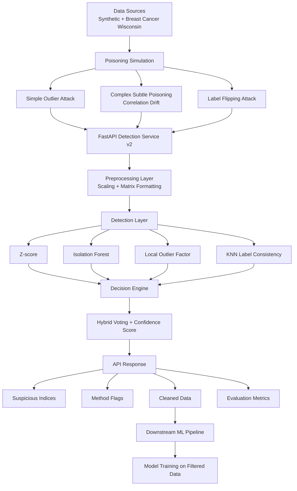

# Final Architecture of the Data Poisoning Detection System

The system works as an API-based security layer for machine learning pipelines. Input data is analyzed before model training, suspicious samples are flagged, and a cleaned dataset can be returned for downstream use.
